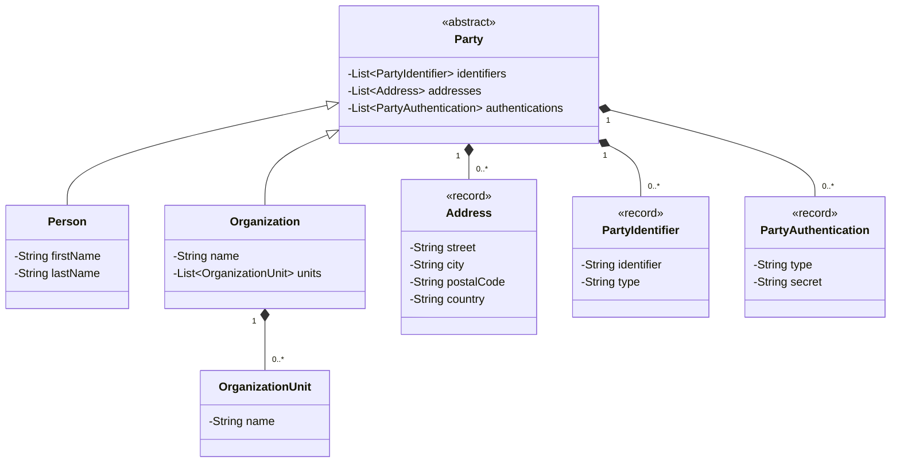

# Party Archetype Pattern

## Purpose
The **Party Archetype Pattern** represents an identifiable, addressable unit that has some autonomous control over its actions and may have legal status. It is a fundamental pattern for modeling people and organizations in a uniform way, allowing systems to treat them interchangeably where appropriate (e.g., both a person and a company can be a "customer" or a "contractor").

## Detailed Explanation
The pattern is designed to solve the complexity of managing entities that can act in various roles within a system. Instead of creating separate, unrelated structures for individuals and groups, the Party Archetype provides a unified base. This allows for:
- **Uniformity:** Treating any entity (person or organization) as a "Party" for core operations like communication (Address) or identification (PartyIdentifier).
- **Flexibility:** Parties can participate in relationships and play different roles without changing their underlying identity.
- **Recursive Structures:** Through `OrganizationUnit`, the pattern naturally supports complex hierarchies, such as companies with branches, departments, and sub-teams.

## Archetype Components

### Mandatory Parts
- **Party (Abstract):** The foundation of the pattern. Every person or organization MUST be a Party to share common capabilities.
- **Person OR Organization:** At least one concrete implementation is required to represent real-world entities.
- **PartyIdentifier:** Essential for distinguishing one party from another (e.g., Unique ID, SSN, Tax ID).

### Optional Parts
- **OrganizationUnit:** Only needed if modeling internal structures of an organization.
- **Address:** Required only if the system needs to locate or contact the party.
- **PartyAuthentication:** Necessary only if the party needs to interact with the system via secured access.

## Parties (Core Archetypes)
- **Party:** An abstract base class for `Person` and `Organization`. It manages common attributes like identifiers, addresses, and authentications.
- **Person:** Represents an individual human being.
- **Organization:** Represents a group of people or other organizations (e.g., a corporation, a department).
- **OrganizationUnit:** Represents a specific part of an `Organization`. It allows for modeling complex, recursive organizational hierarchies.
- **Address:** A distinct archetype for locating and contacting parties (physical address, email, etc.).
- **PartyIdentifier:** A unique identifier for a party, such as a SSN, Tax ID, or Passport Number.
- **PartyAuthentication:** Mechanisms used to verify the identity of a party (e.g., login credentials, digital certificates).

## Dependency Diagram

