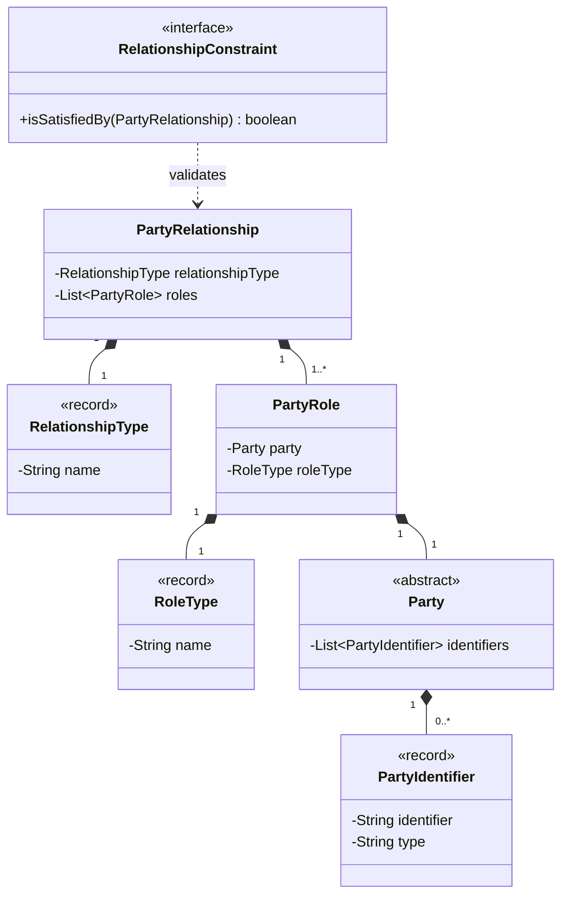

# PartyRelationship Archetype Pattern

## Purpose
The **PartyRelationship Archetype Pattern** describes the relationships between parties and the roles they play within those relationships. It decouples the parties from the relationships, allowing for flexible and dynamic modeling of complex interactions.

## Detailed Explanation
The pattern introduces an intermediate layer of **Roles** between **Parties**. Instead of a direct connection between two parties, each party plays a specific role in a relationship. This provides:
- **Flexibility:** New types of relationships and roles can be added without modifying the core Party classes.
- **Decoupling:** Parties do not need to know about all the relationships they might participate in.
- **Business Rules:** `RelationshipConstraint` allows for formalizing rules about which roles can participate in which relationships.

## Archetype Components

### Mandatory Parts
- **PartyRelationship:** The core of the pattern. Every relationship MUST be a `PartyRelationship` to capture the connection between roles.
- **RelationshipType:** Essential for classifying the kind of relationship (e.g., Employment, Partnership, Friendship).
- **PartyRole:** Required to represent how a `Party` participates in a relationship. A relationship must have at least one role.
- **RoleType:** Essential for defining the capacity in which a party participates (e.g., Employer, Employee, Friend).
- **Party:** At least one concrete implementation is required to represent the entities participating in the relationship.

### Optional Parts
- **RelationshipConstraint:** Only needed if the system must enforce business rules about which roles can form valid relationships.
- **PartyIdentifier:** Required only if parties within the relationship need to be uniquely identified.

## Archetype Classes

- **PartyRelationship:** Represents the actual connection between roles. It holds a `RelationshipType` and a collection of `PartyRole` instances.
- **RelationshipType:** A value object that defines the kind of relationship (e.g., "Employment", "Partnership").
- **PartyRole:** Represents a specific capacity or role that a `Party` plays. It links a `Party` to a `RoleType`.
- **RoleType:** A value object that defines the kind of role (e.g., "Manager", "Customer", "Supplier").
- **RelationshipConstraint:** An interface for defining rules governing the valid formation of relationships.
- **Party:** Abstract base for entities participating in roles.
- **PartyIdentifier:** A unique identifier for a party, such as an ID or Tax Number.

## Dependency Diagram

