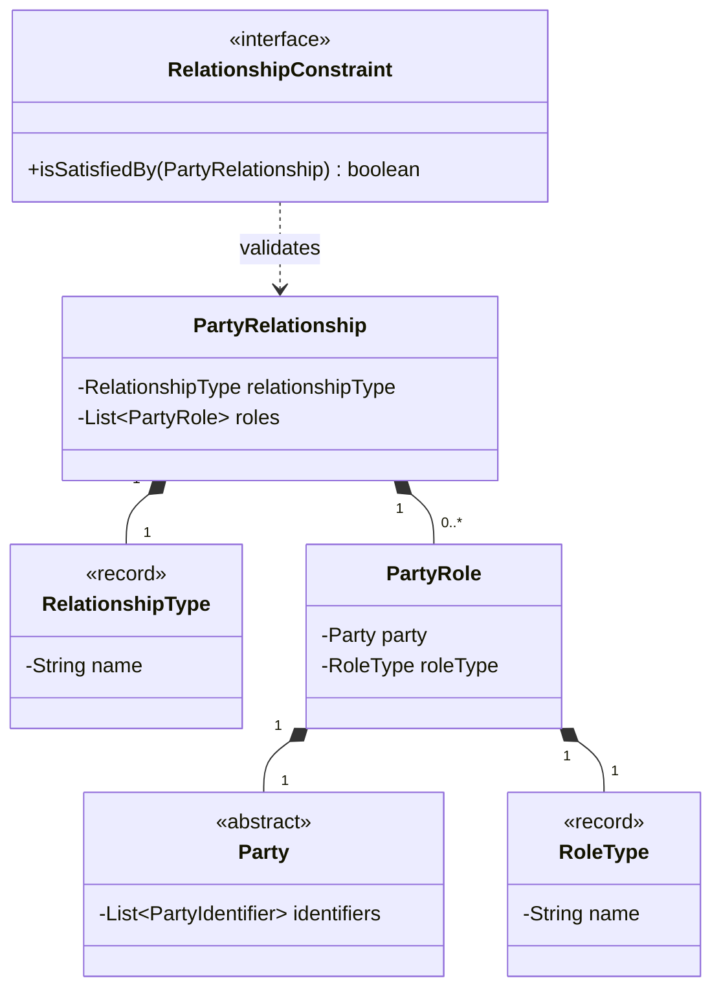

# PartyRelationship Archetype Pattern

## Purpose
The **PartyRelationship Archetype Pattern** describes the relationships between parties and the roles they play within those relationships. It decouples the parties from the relationships, allowing for flexible and dynamic modeling of complex interactions.

## Detailed Explanation
The pattern introduces an intermediate layer of **Roles** between **Parties**. Instead of a direct connection between two parties, each party plays a specific role in a relationship. This provides:
- **Flexibility:** New types of relationships and roles can be added without modifying the core Party classes.
- **Decoupling:** Parties do not need to know about all the relationships they might participate in.
- **Business Rules:** `RelationshipConstraint` allows for formalizing rules about which roles can participate in which relationships.

## Archetype Components

### Core Archetypes
- **PartyRelationship:** Represents the actual connection between roles. It has a `RelationshipType`.
- **RelationshipType:** Defines the kind of relationship (e.g., Employment, Partnership).
- **PartyRole:** Represents a specific capacity or role that a `Party` plays (e.g., Employee, Employer). It has a `RoleType`.
- **RoleType:** Defines the kind of role (e.g., Manager, Customer, Supplier).
- **RelationshipConstraint:** Defines the rules governing the valid formation of relationships.

### Supporting Archetypes (Self-contained)
- **Party:** Abstract base for entities participating in roles.
- **Person & Organization:** Concrete implementations of `Party`.
- **PartyIdentifier:** Unique identifier for a `Party`.

## Dependency Diagram

